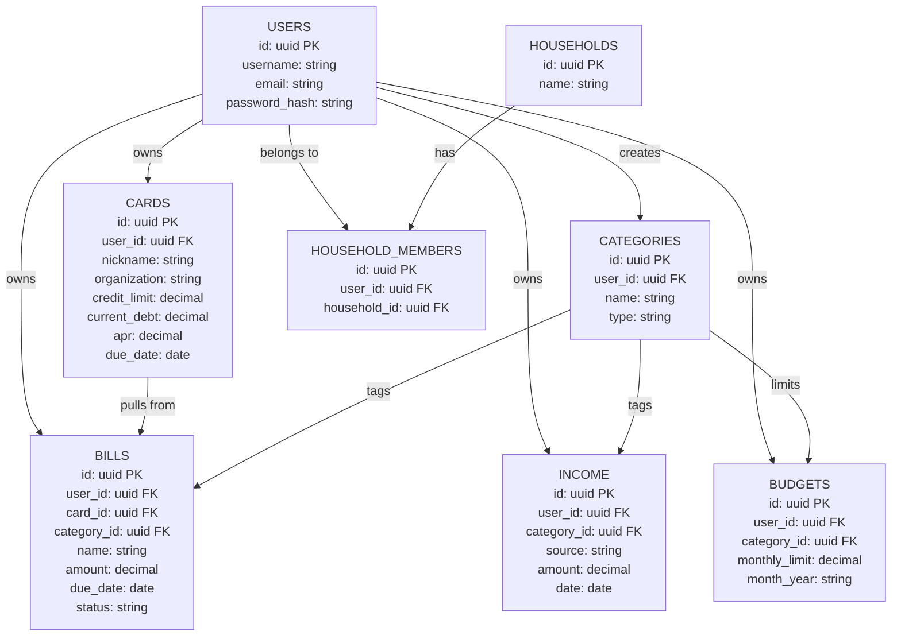

# WealthSight
Easily display your income and expenses in a meaningful way!

```mermaid
graph TD;
    USERS["USERS<br/>id: uuid PK<br/>username: string<br/>email: string<br/>password_hash: string"]
    CATEGORIES["CATEGORIES<br/>id: uuid PK<br/>user_id: uuid FK<br/>name: string<br/>type: string"]
    CARDS["CARDS<br/>id: uuid PK<br/>user_id: uuid FK<br/>nickname: string<br/>organization: string<br/>credit_limit: decimal<br/>current_debt: decimal<br/>apr: decimal<br/>due_date: date"]
    BILLS["BILLS<br/>id: uuid PK<br/>user_id: uuid FK<br/>card_id: uuid FK<br/>category_id: uuid FK<br/>name: string<br/>amount: decimal<br/>due_date: date<br/>status: string"]
    INCOME["INCOME<br/>id: uuid PK<br/>user_id: uuid FK<br/>category_id: uuid FK<br/>source: string<br/>amount: decimal<br/>date: date"]
    BUDGETS["BUDGETS<br/>id: uuid PK<br/>user_id: uuid FK<br/>category_id: uuid FK<br/>monthly_limit: decimal<br/>month_year: string"]
    HOUSEHOLDS["HOUSEHOLDS<br/>id: uuid PK<br/>name: string"]
    HOUSEHOLD_MEMBERS["HOUSEHOLD_MEMBERS<br/>id: uuid PK<br/>user_id: uuid FK<br/>household_id: uuid FK"]

    USERS -->|creates| CATEGORIES;
    USERS -->|owns| CARDS;
    USERS -->|owns| BILLS;
    USERS -->|owns| INCOME;
    USERS -->|owns| BUDGETS;
    CARDS -->|pulls from| BILLS;
    CATEGORIES -->|tags| BILLS;
    CATEGORIES -->|tags| INCOME;
    CATEGORIES -->|limits| BUDGETS;
    USERS -->|belongs to| HOUSEHOLD_MEMBERS;
    HOUSEHOLDS -->|has| HOUSEHOLD_MEMBERS;
```