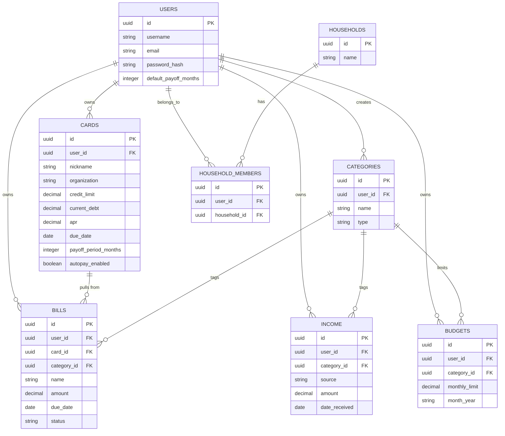

# WealthSight

> A single place to track my finances.

[Live Demo](#) · [Report a Bug](#) · [Request a Feature](#)

## Table of Contents
- [Description](#description)
- [Tech Stack](#tech-stack)
- [Installation](#installation)
- [Usage](#usage)
- [ERD](#erd)
- [API Endpoints](#api-endpoints)
- [Testing](#testing)
- [Roadmap](#roadmap)
- [Known Issues](#known-issues)
- [Dev Log / Changelog](#dev-log--changelog)
- [License](#license)

---

## Description

Most personal finance tracking fails in one of two ways: either it's
fragmented between multiple apps and spreadsheets, or it's over-automated
and removes the user from the loop, killing financial awareness.

WealthSight approaches from a different angle. Over-automation gives you
the *feeling* of being on top of your finances — without the
understanding. Manual entry is our tool to bring the user back into the
loop. The friction you feel when entering your transactions and summaries
is what builds financial awareness. It plays into the idea of
"Delayed Gratification": discomfort now gives larger rewards later.

Its features should be familiar. It's everything you wanted your
spreadsheet to do.

### Features
- Track income and expenses in one place
- Manage credit cards and loans (limit, debt, APR, due dates)
- Mark bills as Paid / Unpaid / Upcoming, with due-date reminders
- Set category-based budgets and compare against actual spending
- Persistent dashboard summary (income, expenses, debt, next payment)
  visible across every view

<!--  -->

---

## Tech Stack

**Frontend:** React (Vite), React Router, [styling framework TBD]
**Backend:** Node.js, Express
**Database:** PostgreSQL, Knex.js
**Testing:** Jest, Supertest
**Deployment:** Render

---

## Installation

Clone the repo and set up both the client and server.

```bash
git clone https://github.com/<your-username>/WealthSight.git
cd WealthSight
```

### Server setup
```bash
cd server
npm install
```

Create a `.env` file in `/server` (see `.env.example`):
```
PORT=3000
DB_HOST=localhost
DB_PORT=5432
DB_USER=postgres
DB_PASSWORD=your_password_here
DB_NAME=wealthsight
```

Run migrations and seed the database:
```bash
npx knex migrate:latest
npx knex seed:run
```

Start the server:
```bash
npm run dev
```

### Client setup
```bash
cd client
npm install
npm run dev
```

The app should now be running at `http://localhost:5173`, with the API
at `http://localhost:3000`.

---

## Usage

*(To be completed once core flows are built — will walk through signing
up, adding income/bills/cards, and reading the dashboard.)*

---

## ERD



---

## API Endpoints

<details>
<summary>Click to expand: full endpoint list</summary>

| Method | Route | Description |
|---|---|---|
| GET | `/api/cards` | Get all cards for the logged-in user |
| POST | `/api/cards` | Create a new card |
| GET | `/api/cards/:id` | Get a single card |
| PUT | `/api/cards/:id` | Update a card |
| DELETE | `/api/cards/:id` | Delete a card |
| GET | `/api/bills` | Get all bills |
| POST | `/api/bills` | Create a new bill |
| GET | `/api/bills/:id` | Get a single bill |
| PUT | `/api/bills/:id` | Update a bill |
| DELETE | `/api/bills/:id` | Delete a bill |
| GET | `/api/income` | Get all income entries |
| POST | `/api/income` | Create a new income entry |
| GET | `/api/income/:id` | Get a single income entry |
| PUT | `/api/income/:id` | Update an income entry |
| DELETE | `/api/income/:id` | Delete an income entry |
| GET | `/api/budgets` | Get all budgets |
| POST | `/api/budgets` | Create a new budget |
| GET | `/api/budgets/:id` | Get a single budget |
| PUT | `/api/budgets/:id` | Update a budget |
| DELETE | `/api/budgets/:id` | Delete a budget |

*(Update this table as routes are actually built — this is the planned
set, not yet all implemented.)*

</details>

---

## Testing

```bash
cd server
npm test
```

*(To be completed with actual coverage details as tests are written.)*

---

## Roadmap

- [ ] Core CRUD: cards, bills, income, budgets
- [ ] Persistent dashboard summary (hero layout)
- [ ] Bill status tracking (Paid/Unpaid/Upcoming) with due-date display
- [ ] Category-based budgeting with visual breakdown
- [ ] Deploy to Render
- [ ] **Stretch:** Joint/household combined view
- [ ] **Stretch:** Faker.js-seeded demo data

---

## Known Issues

*(To be updated as they come up — documenting real limitations honestly
rather than implying a finished product.)*

---

## Dev Log / Changelog

<details>
<summary>Click to expand: dev log</summary>

### 2026-08-24
- Project scoped: WealthSight, a manual-entry finance tracker built
  around the "delayed gratification" design philosophy.
- Problem statement, user stories, and ERD finalized.
- Decision tree wireframe and initial POC wireframes (Login/Signup,
  Dashboard, Income, Expenses, Cards, Budget) completed in Lucidchart.
- Repo initialized, license selected (MIT), README scaffolded.

</details>

---

## License

This project is licensed under the MIT License — see [LICENSE](./LICENSE)
for details.
