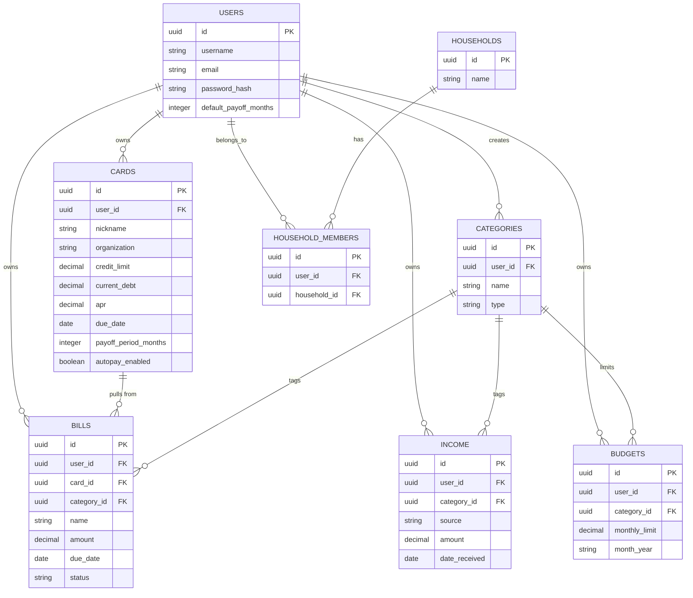

# WealthSight

> A single place to track my finances.

[Live Demo](#) · [Report a Bug](#) · [Request a Feature](#)

## Table of Contents
- [Description](#description)
- [Tech Stack](#tech-stack)
- [Installation](#installation)
- [Usage](#usage)
- [ERD](#erd)
- [API Endpoints](#api-endpoints)
- [Testing](#testing)
- [Roadmap](#roadmap)
- [Known Issues](#known-issues)
- [Dev Log / Changelog](#dev-log--changelog)
- [License](#license)

---

## Description

Most personal finance tracking fails in one of two ways: either it's
fragmented between multiple apps and spreadsheets, or it's over-automated
and removes the user from the loop, killing financial awareness.

WealthSight approaches from a different angle. Over-automation gives you
the *feeling* of being on top of your finances — without the
understanding. Manual entry is our tool to bring the user back into the
loop. The friction you feel when entering your transactions and summaries
is what builds financial awareness. It plays into the idea of
"Delayed Gratification": discomfort now gives larger rewards later.

Its features should be familiar. It's everything you wanted your
spreadsheet to do.

### Features
- Track income and expenses in one place
- Manage credit cards and loans (limit, debt, APR, due dates)
- Mark bills as Paid / Unpaid / Upcoming, with due-date reminders
- Set category-based budgets and compare against actual spending
- Persistent dashboard summary (income, expenses, debt, next payment)
  visible across every view

<!--  -->

---

## Tech Stack

**Frontend:** React (Vite), React Router, [styling framework TBD]
**Backend:** Node.js, Express
**Database:** PostgreSQL, Knex.js
**Testing:** Jest, Supertest
**Deployment:** Render

---

## Installation

Clone the repo and set up both the client and server.

```bash
git clone https://github.com/<your-username>/WealthSight.git
cd WealthSight
```

### Server setup
```bash
cd server
npm install
```

Create a `.env` file in `/server` (see `.env.example`):
```
PORT=3000
DB_HOST=localhost
DB_PORT=5432
DB_USER=postgres
DB_PASSWORD=your_password_here
DB_NAME=wealthsight
```

Run migrations and seed the database:
```bash
npx knex migrate:latest
npx knex seed:run
```

Start the server:
```bash
npm run dev
```

### Client setup
```bash
cd client
npm install
npm run dev
```

The app should now be running at `http://localhost:5173`, with the API
at `http://localhost:3000`.

---

## Usage

*(To be completed once core flows are built — will walk through signing
up, adding income/bills/cards, and reading the dashboard.)*

---

## ERD



---

## API Endpoints

<details>
<summary>Click to expand: full endpoint list</summary>

| Method | Route | Description |
|---|---|---|
| POST | `/users/signup` | Create a new user account |
| POST | `/users/login` | Log in, sets an HttpOnly session cookie |
| GET | `/cards` | Get all cards for the logged-in user |
| POST | `/cards` | Create a new card |
| GET | `/cards/:id` | Get a single card |
| PUT | `/cards/:id` | Update a card |
| DELETE | `/cards/:id` | Delete a card |
| GET | `/bills` | Get all bills |
| POST | `/bills` | Create a new bill |
| GET | `/bills/:id` | Get a single bill |
| PUT | `/bills/:id` | Update a bill |
| DELETE | `/bills/:id` | Delete a bill |
| GET | `/income` | Get all income entries |
| POST | `/income` | Create a new income entry |
| GET | `/income/:id` | Get a single income entry |
| PUT | `/income/:id` | Update an income entry |
| DELETE | `/income/:id` | Delete an income entry |
| GET | `/budgets` | Get all budgets |
| POST | `/budgets` | Create a new budget |
| GET | `/budgets/:id` | Get a single budget |
| PUT | `/budgets/:id` | Update a budget |
| DELETE | `/budgets/:id` | Delete a budget |
| GET | `/categories` | Get all categories |
| POST | `/categories` | Create a new category |
| GET | `/categories/:id` | Get a single category |
| PUT | `/categories/:id` | Update a category |
| DELETE | `/categories/:id` | Delete a category |

All routes above (except signup/login) require authentication via the
`userId` HttpOnly cookie set at login, and are scoped so a user can only
read/modify their own data. All are implemented and manually tested via
Postman.

</details>

---

## Testing

```bash
cd server
npm test
```

*(To be completed with actual coverage details as tests are written.)*

---

## Roadmap

- [x] Database schema: 6 core tables migrated and verified
- [x] User signup + login (bcrypt password hashing, HttpOnly cookie session)
- [x] Auth middleware (protect routes, scope data to logged-in user)
- [x] Full CRUD: cards, bills, income, budgets, categories
- [ ] Persistent dashboard summary (hero layout)
- [ ] Bill status tracking (Paid/Unpaid/Upcoming) with due-date display
- [ ] Category-based budgeting with visual breakdown
- [ ] Deploy to Render
- [ ] **Stretch:** Joint/household combined view
- [ ] **Stretch:** Faker.js-seeded demo data

---

## Known Issues

*(To be updated as they come up — documenting real limitations honestly
rather than implying a finished product.)*

---

## Dev Log / Changelog

<details>
<summary>Click to expand: dev log</summary>

### 2026-08-27
- Built `middleware/checkAuth.js`: reads the `userId` HttpOnly cookie,
  attaches it to `req.userId`, or rejects with 401 if absent. Verified
  with a temporary protected test route before wiring it into real
  routes.
- Built full CRUD (`routes/cards.js`) as the template pattern for every
  other resource: every route behind `checkAuth`, every query scoped to
  `where({ user_id: req.userId })`, ownership checked on GET-one/PUT/
  DELETE, `user_id` always set server-side on insert (never trusted from
  the client body).
- Applied the same pattern to `routes/bills.js`, `routes/income.js`,
  `routes/budgets.js`, `routes/categories.js` — full CRUD on all five
  resources.
- `bills` (and `income`/`budgets` via `category_id`) add an extra
  ownership check on any foreign key submitted in the request body —
  e.g. a bill's `card_id` must belong to the requesting user, not just
  exist — to prevent one user from tagging their data with another
  user's card/category.
- All 26 routes (signup/login + 5x full CRUD) manually tested end-to-end
  via Postman against the live database.
- Fixed a real bug caught during testing: `budgets.js` initially queried
  a nonexistent `budget` table (singular) instead of `budgets`.

### 2026-08-26 (cont.)
- Installed `bcrypt` for password hashing.
- Built `routes/users.js` (Express Router pattern) and mounted it in
  `index.js` at `/users`.
- `POST /users/signup` — hashes password with bcrypt (10 salt rounds),
  inserts the user, returns `id`/`username`/`email` only (never the
  hash). Tested and verified against the live database.
- `POST /users/login` — looks up user by email, compares password via
  `bcrypt.compare`, returns a generic 401 for both "no such email" and
  "wrong password" to avoid a user-enumeration vulnerability. On
  success, sets an `HttpOnly` cookie (`userId`, 24hr expiry) and
  returns the user's public fields. Tested via Postman — response
  body and `Set-Cookie` both verified.

### 2026-08-26
- Server scaffolded: Express app (`index.js`), `.env`, `knexfile.js`
  with separate development/test database configs.
- Local Postgres set up via `docker-compose.yaml` (db-only container,
  no app containerization for this project since deploy target is
  Render).
- Built and verified all 6 core migrations against a live database:
  `users`, `categories`, `cards`, `bills`, `income`, `budgets`.
- Deliberate foreign-key strategy applied per relationship: `user_id`
  CASCADE everywhere; `card_id`/`category_id` on dependent tables
  SET NULL, so deleting a card or category doesn't destroy bill/
  income/budget history.
- Added CHECK constraints for `categories.type` and `bills.status` to
  enforce valid values at the database level.
- Extended `cards` beyond the original ERD: `payoff_period_months`
  (nullable, falls back to a new `users.default_payoff_months`) and
  `autopay_enabled`, supporting per-card snowball/avalanche payoff
  targeting. Suggested/next payment is calculated on the fly from
  `current_debt`, `apr`, and payoff period — not stored, to avoid
  stale derived data.
- Extended `bills` with a `recurring` flag to distinguish one-time
  expenses from repeating bills.
- Fixed a naming inconsistency (`income.dateReceived` →
  `date_received`) to match snake_case convention used throughout.
- ERD.md and this README's embedded ERD updated to match the final,
  verified schema.
- Installed encryption node for password security


### 2026-08-25
- Decision tree wireframe built and iterated in Lucidchart — added
  return-loop arrows so every sub-view routes back to the Dashboard
  instead of dead-ending.
- POC wireframes built for Login/Signup, Dashboard, Income, Expenses,
  Cards, and Budget screens.
- Settled on a persistent hero + swappable content-area layout for the
  Dashboard (React Router layout route with a nested `<Outlet />`),
  so summary totals stay visible across every sub-view.
- README structured section by section: table of contents ordering,
  hero/pitch copy, Description, collapsible `<details>` sections for
  the API table and dev log.
- Full project Kanban populated (Icebox → Needs Discussion → In
  Progress → Review → Completed) covering the remaining scope of
  the build.

### 2026-08-24
- Project scoped: WealthSight, a manual-entry finance tracker built
  around the "delayed gratification" design philosophy.
- Problem statement, user stories, and ERD finalized.
- Repo initialized, license selected (MIT), README scaffolded.

</details>

---

## License

This project is licensed under the MIT License — see [LICENSE](./LICENSE)
for details.
