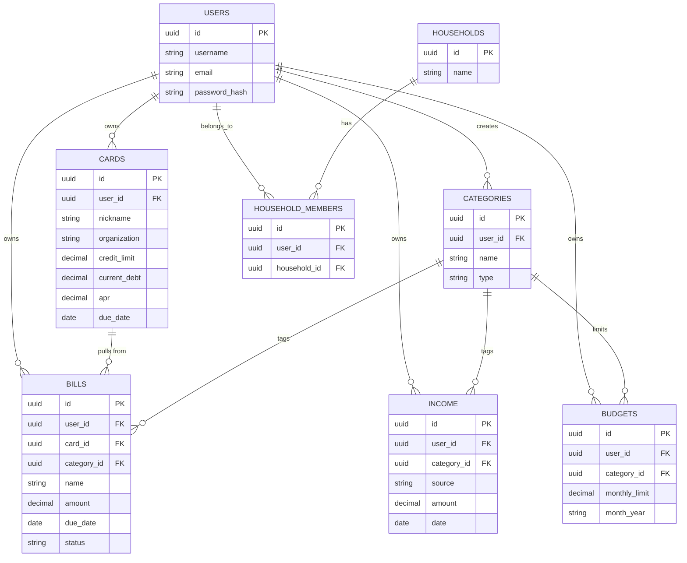

# WealthSight
> A single place to track your finances

[Live Demo](#) · [Report a Bug](https://github.com/JAugustineFlory/WealthSight/issues) · [Request a Feature](https://github.com/JAugustineFlory/WealthSight/wiki)
---

## Table of Contents
- [Description](#description)
- [Tech Stack](#tech-stack)
- [Installation](#installation)
- [Usage](#usage)
- [ERD](#erd)
- [API Endpoints](#api-endpoints)
- [Testing](#testing)
- [Roadmap](#roadmap)
- [Known Issues](#known-issues)
- [Dev Log / Changelog](#dev-log--changelog)
- [License](#license)
---

### ERD - Entity Relationship Diagram

---
### Decision Tree Wireframe

---
