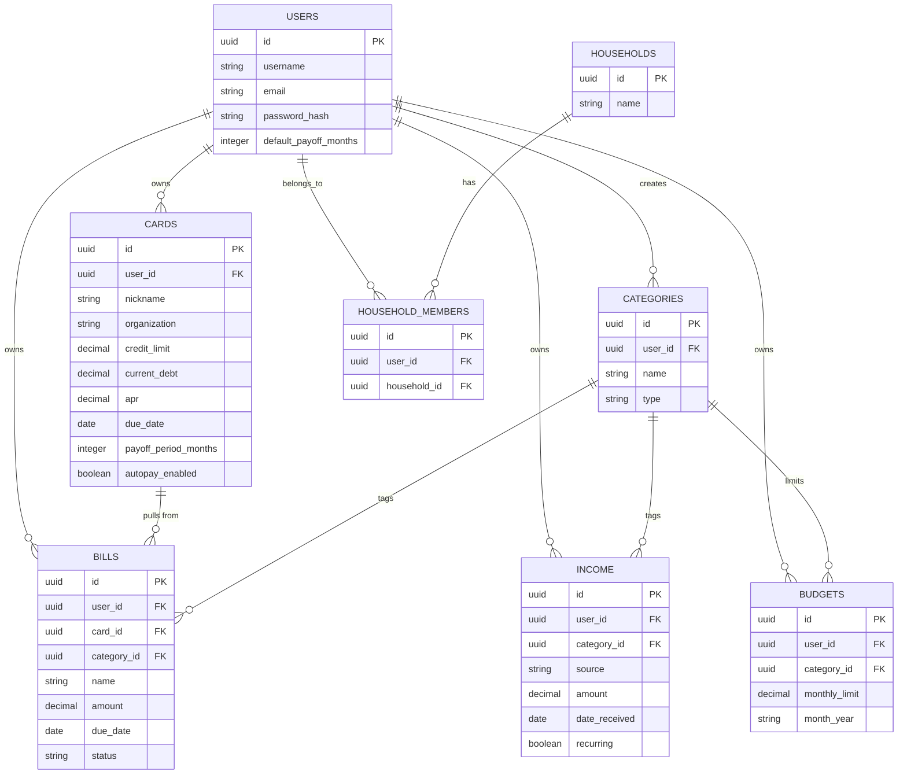

# WealthSight

> A single place to track my finances.

[Live Demo](#) · [Report a Bug](#) · [Request a Feature](#)

## Table of Contents
- [Description](#description)
- [Tech Stack](#tech-stack)
- [Installation](#installation)
- [Usage](#usage)
- [ERD](#erd)
- [API Endpoints](#api-endpoints)
- [Testing](#testing)
- [Roadmap](#roadmap)
- [Planned Features / Next Update](#planned-features--next-update)
- [Known Issues](#known-issues)
- [Dev Log / Changelog](#dev-log--changelog)
- [License](#license)

---

## Description

Most personal finance tracking fails in one of two ways: either it's
fragmented between multiple apps and spreadsheets, or it's over-automated
and removes the user from the loop, killing financial awareness.

WealthSight approaches from a different angle. Over-automation gives you
the *feeling* of being on top of your finances — without the
understanding. Manual entry is our tool to bring the user back into the
loop. The friction you feel when entering your transactions and summaries
is what builds financial awareness. It plays into the idea of
"Delayed Gratification": discomfort now gives larger rewards later.

Its features should be familiar. It's everything you wanted your
spreadsheet to do.

### Features
- Track income and expenses in one place
- Manage credit cards and loans (limit, debt, APR, due dates)
- Mark bills as Paid / Unpaid / Upcoming, with due-date reminders
- Set category-based budgets and compare against actual spending
- Persistent dashboard summary (income, expenses, debt, next payment)
  visible across every view

<!--  -->

---

## Tech Stack

**Frontend:** React (Vite), React Router, [styling framework TBD]
**Backend:** Node.js, Express
**Database:** PostgreSQL, Knex.js
**Testing:** Jest, Supertest
**Deployment:** Render

---

## Installation

Clone the repo and set up both the client and server.

```bash
git clone https://github.com/<your-username>/WealthSight.git
cd WealthSight
```

### Server setup
```bash
cd server
npm install
```

Create a `.env` file in `/server` (see `.env.example`):
```
PORT=3000
DB_HOST=localhost
DB_PORT=5432
DB_USER=postgres
DB_PASSWORD=your_password_here
DB_NAME=wealthsight
```

Run migrations and seed the database:
```bash
npx knex migrate:latest
npx knex seed:run
```

Start the server:
```bash
npm run dev
```

### Client setup
```bash
cd client
npm install
npm run dev
```

The app should now be running at `http://localhost:5173`, with the API
at `http://localhost:3000`.

---

## Usage

*(To be completed once core flows are built — will walk through signing
up, adding income/bills/cards, and reading the dashboard.)*

---

## ERD



---

## API Endpoints

<details>
<summary>Click to expand: full endpoint list</summary>

| Method | Route | Description |
|---|---|---|
| POST | `/users/signup` | Create a new user account (auto-logs in) |
| POST | `/users/login` | Log in, sets an HttpOnly session cookie |
| GET | `/users/me` | Get the currently authenticated user, or 401 |
| GET | `/cards` | Get all cards for the logged-in user |
| POST | `/cards` | Create a new card |
| GET | `/cards/:id` | Get a single card |
| PUT | `/cards/:id` | Update a card |
| DELETE | `/cards/:id` | Delete a card |
| GET | `/bills` | Get all bills |
| POST | `/bills` | Create a new bill |
| GET | `/bills/:id` | Get a single bill |
| PUT | `/bills/:id` | Update a bill |
| DELETE | `/bills/:id` | Delete a bill |
| GET | `/income` | Get all income entries |
| POST | `/income` | Create a new income entry |
| GET | `/income/:id` | Get a single income entry |
| PUT | `/income/:id` | Update an income entry |
| DELETE | `/income/:id` | Delete an income entry |
| GET | `/budgets` | Get all budgets |
| POST | `/budgets` | Create a new budget |
| GET | `/budgets/:id` | Get a single budget |
| PUT | `/budgets/:id` | Update a budget |
| DELETE | `/budgets/:id` | Delete a budget |
| GET | `/categories` | Get all categories |
| POST | `/categories` | Create a new category |
| GET | `/categories/:id` | Get a single category |
| PUT | `/categories/:id` | Update a category |
| DELETE | `/categories/:id` | Delete a category |

All routes above (except signup/login) require authentication via the
`userId` HttpOnly cookie set at login, and are scoped so a user can only
read/modify their own data. All are implemented and manually tested via
Postman.

</details>

---

## Testing

```bash
cd server
npm test
```

*(To be completed with actual coverage details as tests are written.)*

---

## Roadmap

- [x] Database schema: 6 core tables migrated and verified
- [x] User signup + login (bcrypt password hashing, HttpOnly cookie session)
- [x] Auth middleware (protect routes, scope data to logged-in user)
- [x] Full CRUD: cards, bills, income, budgets, categories
- [x] Client-side auth: React Router layout + AuthContext, session
      persists across reload via `/users/me`
- [x] Login/Signup UI (single toggled form, auto-login on signup)
- [x] Persistent dashboard summary (hero layout)
- [x] Net income line graph (Recharts, real income vs. bills data by month)
- [x] Full CRUD UI for Income, Bills, Cards, Budgets (add/edit/delete)
- [x] Bill status tracking (Paid/Unpaid/Upcoming) via manual toggle buttons
- [x] Credit utilization warning (highlights + hover message at ≥30%)
- [x] Suggested payment calculation (amortized, per-card or user-default
      payoff period)
- [ ] Category-based budgeting with visual breakdown (chart)
- [ ] Deploy to Render
- [ ] Automated test suite (Jest/Supertest)
- [ ] **Stretch:** Joint/household combined view
- [ ] **Stretch:** Faker.js-seeded demo data

---

## Planned Features / Next Update

Built fast to hit the Project 3 deadline — these are deliberate, logged
scope decisions, not oversights. Listed here so they're not mistaken for
bugs, and so they're an honest, visible "what I'd do with more time" list
for the presentation.

- **Dedicated Categories management page.** Right now categories can only
  be created via a small inline "+ Add Category" quick-add on the Bills
  and Budgets pages (name only, type hardcoded to `expense`). A real
  Categories page (list, edit, delete, and letting income categories be
  typed as `income`) is the next real gap to close.
- **Net income graph on the Dashboard.** ~~Currently a placeholder box.~~
  Built — real Recharts line chart driven by actual income vs. bills
  totals per month.
- **Budget-vs-actual comparison.** Budgets currently just store a limit;
  they don't yet compare against real spending in that category.
- **Recurring bill automation.** The `recurring` flag exists on bills but
  doesn't yet auto-generate the next month's bill or roll due dates
  forward automatically.
- **Snowball/avalanche guided payoff strategy.** Per-card payoff periods
  are supported (so a user *can* manually target one card), but the app
  doesn't yet suggest a strategy across multiple cards.
- **Unsaved-changes confirmation.** Originally planned via React Router's
  `useBlocker`; not yet wired in — currently navigating away from an
  in-progress edit silently discards it.
- **Themed delete-confirmation modal.** Delete actions currently use the
  browser's native `window.confirm()` — functional and reliable, but it
  can't be restyled to match the app's theme. A custom modal component
  is the natural upgrade.
- **Joint/household view.** Logged from the start as a stretch goal (see
  ERD's `HOUSEHOLDS`/`HOUSEHOLD_MEMBERS` tables, already schema-ready but
  unused).

---

## Known Issues

- Wireframes were intentionally left rough in places, with the plan to
  refine details during the build itself — a few small UI/UX gaps below
  are a direct result of that, not missed requirements.
- No automated test suite yet (Jest/Supertest set up in `package.json`
  but no tests written) — all verification so far has been manual, via
  Postman and in-browser testing.
- `checkAuth` middleware confirms a session cookie is present but doesn't
  re-verify the user still exists on every request (a separate `/users/me`
  check does do this, but it isn't called on every single API request —
  only on app load).
- No CORS config for a production origin yet — `server/index.js` only
  allows `http://localhost:5173`; will need updating once deployed.
- Dates round-trip through Postgres with a timezone-shifted time
  component (e.g. `T04:00:00.000Z` on a plain date column); display is
  correctly trimmed to just the date in the UI, but worth knowing if this
  ever gets queried directly.
- No image/screenshot assets in the README yet — planned once the UI is
  visually polished.

---

## Dev Log / Changelog

<details>
<summary>Click to expand: dev log</summary>

### 2026-08-30
- Applied a cyber-themed dark palette (`theme.css`): navy background with
  a hex-grid texture, glowing cyan accents, small glowing hexagon markers
  on hero stats — shared CSS variables so every page/component stays
  visually consistent rather than each having its own hardcoded colors.
- Fixed a real architectural gap: the hero's totals weren't updating
  after adding/editing/deleting on a sub-page (each page had its own
  independent fetch, with no way to tell `Layout` to refetch). Fixed via
  React Router's `<Outlet context={{ refreshHeroData }} />` — every
  CRUD page now calls `refreshHeroData()` after a successful mutation.
- Fixed page content rendering flush-left instead of centered under the
  hero (`main` was missing `display: flex; justify-content: center`);
  widened every page's max-width so centering didn't just make things
  look cramped.
- Added a real Recharts line graph to the Dashboard (net income by
  month, computed from actual income/bills data — no placeholder,
  no fabricated numbers).
- Redesigned the Cards list from a flex-wrap layout (misaligned columns)
  to a CSS grid with a shared column template between the header row and
  every data row, guaranteeing alignment regardless of content length.
  Replaced the payoff-months number input with a range slider (default
  30), and labeled the due-date field, which was previously a bare
  unlabeled date picker.
- Added delete confirmation (`window.confirm`) on all four CRUD pages.
- Added client-side required-field validation: Add/Save buttons are now
  `disabled` until required fields are filled, closing the gap where an
  incomplete submission could reach the server and surface a raw
  Postgres error message directly to the user.
- Added a `recurring` flag to `income` (new migration — `alterTable`,
  not a fresh `createTable`, since the table already had real data),
  matching the flag `bills` already had, for consistent paychecks.

### 2026-08-29 (frontend build)
- Built `client/src/utils/finance.js`: `calculateSuggestedPayment`
  (amortization formula, with a 0%-APR and 0-months edge case handled),
  `formatCurrency`, `formatDate` — pure functions, reused across every
  page rather than duplicated per component.
- Built the persistent hero in `Layout.jsx`: fetches cards/bills/income
  once a user is authenticated, computes Monthly Income, Monthly
  Expenses, Total Debt, Remaining, and Next Payment (soonest unpaid/
  upcoming bill) live from real data. Each stat links to its section;
  the link swaps to "Close" (via `useLocation`) when already on that
  page, rather than showing a redundant link to the current page.
- Added an `index: true` Dashboard route (separate from the always-
  visible hero) showing the budget mini-table; net income graph is a
  placeholder pending Recharts.
- Built full add/edit/delete CRUD UI for **Income**, **Bills**,
  **Cards**, and **Budgets** — one bundled `formData` object per page
  (`useState`), one `handleSubmit` that POSTs or PUTs depending on
  whether an entry is being edited, matching pattern across all four.
- **Bills**: manual Paid/Unpaid/Upcoming status toggle buttons (per
  design decision — status changes are a deliberate user action, not
  automatic), optional card/category dropdowns.
- **Cards**: credit utilization % calculated live (`current_debt /
  credit_limit`), row highlights and shows a hover warning at ≥30%
  utilization; suggested payment shown per card using the amortization
  util, falling back to the user's `default_payoff_months` (added to
  `GET /users/me`'s response) when a card has no override set.
- Categories have no dedicated management page yet — Bills and Budgets
  both include a small inline "+ Add Category" quick-create instead, to
  keep the FK dropdowns usable without expanding scope further this
  close to the deadline. Logged as a real gap in Planned Features, not
  silently skipped.
- README: added a **Planned Features / Next Update** section documenting
  every deliberate scope cut made building fast under deadline, and
  filled in **Known Issues** with real, current limitations (no test
  suite yet, CORS is dev-only, `checkAuth` doesn't re-verify user
  existence on every request).

### 2026-08-28
- Added `GET /users/me`: verifies the session cookie against a real
  user in the database (closing the honest gap in `checkAuth`, which
  only checks the cookie's *presence*, not whether that user still
  exists) and returns the current user, or 401.
- Added `credentials: true` + an explicit origin to server CORS config
  — a wildcard origin can't be combined with credentialed (cookie)
  requests; browsers block that combination outright.
- Set up React Router with `createBrowserRouter` (the data-router API,
  required for `useBlocker` later) and a `Layout` component using a
  nested `<Outlet />` for the persistent-hero pattern planned during
  wireframing.
- Built `AuthContext`: calls `GET /users/me` once on app load
  (`useEffect`, empty dependency array), stores the result in shared
  state via React Context so any component can read auth status
  without prop-drilling.
- Built a single toggled Login/Signup form (`signUpMode` state) rather
  than two separate components — shares all form state and submit
  logic, calls whichever endpoint matches the current mode.
- `POST /users/signup` now also sets the session cookie, so signup
  auto-logs the user in — one request instead of chaining signup then
  login.
- `Layout` reads `{ user, loading }` from `AuthContext` and renders
  Login, a loading state, or the real hero/Outlet view accordingly —
  verified end-to-end: fresh load shows Login, signup/login both
  transition straight to the authenticated view with no manual reload.

### 2026-08-27
- Built `middleware/checkAuth.js`: reads the `userId` HttpOnly cookie,
  attaches it to `req.userId`, or rejects with 401 if absent. Verified
  with a temporary protected test route before wiring it into real
  routes.
- Built full CRUD (`routes/cards.js`) as the template pattern for every
  other resource: every route behind `checkAuth`, every query scoped to
  `where({ user_id: req.userId })`, ownership checked on GET-one/PUT/
  DELETE, `user_id` always set server-side on insert (never trusted from
  the client body).
- Applied the same pattern to `routes/bills.js`, `routes/income.js`,
  `routes/budgets.js`, `routes/categories.js` — full CRUD on all five
  resources.
- `bills` (and `income`/`budgets` via `category_id`) add an extra
  ownership check on any foreign key submitted in the request body —
  e.g. a bill's `card_id` must belong to the requesting user, not just
  exist — to prevent one user from tagging their data with another
  user's card/category.
- All 26 routes (signup/login + 5x full CRUD) manually tested end-to-end
  via Postman against the live database.
- Fixed a real bug caught during testing: `budgets.js` initially queried
  a nonexistent `budget` table (singular) instead of `budgets`.

### 2026-08-26 (cont.)
- Installed `bcrypt` for password hashing.
- Built `routes/users.js` (Express Router pattern) and mounted it in
  `index.js` at `/users`.
- `POST /users/signup` — hashes password with bcrypt (10 salt rounds),
  inserts the user, returns `id`/`username`/`email` only (never the
  hash). Tested and verified against the live database.
- `POST /users/login` — looks up user by email, compares password via
  `bcrypt.compare`, returns a generic 401 for both "no such email" and
  "wrong password" to avoid a user-enumeration vulnerability. On
  success, sets an `HttpOnly` cookie (`userId`, 24hr expiry) and
  returns the user's public fields. Tested via Postman — response
  body and `Set-Cookie` both verified.

### 2026-08-26
- Server scaffolded: Express app (`index.js`), `.env`, `knexfile.js`
  with separate development/test database configs.
- Local Postgres set up via `docker-compose.yaml` (db-only container,
  no app containerization for this project since deploy target is
  Render).
- Built and verified all 6 core migrations against a live database:
  `users`, `categories`, `cards`, `bills`, `income`, `budgets`.
- Deliberate foreign-key strategy applied per relationship: `user_id`
  CASCADE everywhere; `card_id`/`category_id` on dependent tables
  SET NULL, so deleting a card or category doesn't destroy bill/
  income/budget history.
- Added CHECK constraints for `categories.type` and `bills.status` to
  enforce valid values at the database level.
- Extended `cards` beyond the original ERD: `payoff_period_months`
  (nullable, falls back to a new `users.default_payoff_months`) and
  `autopay_enabled`, supporting per-card snowball/avalanche payoff
  targeting. Suggested/next payment is calculated on the fly from
  `current_debt`, `apr`, and payoff period — not stored, to avoid
  stale derived data.
- Extended `bills` with a `recurring` flag to distinguish one-time
  expenses from repeating bills.
- Fixed a naming inconsistency (`income.dateReceived` →
  `date_received`) to match snake_case convention used throughout.
- ERD.md and this README's embedded ERD updated to match the final,
  verified schema.
- Installed encryption node for password security


### 2026-08-25
- Decision tree wireframe built and iterated in Lucidchart — added
  return-loop arrows so every sub-view routes back to the Dashboard
  instead of dead-ending.
- POC wireframes built for Login/Signup, Dashboard, Income, Expenses,
  Cards, and Budget screens.
- Settled on a persistent hero + swappable content-area layout for the
  Dashboard (React Router layout route with a nested `<Outlet />`),
  so summary totals stay visible across every sub-view.
- README structured section by section: table of contents ordering,
  hero/pitch copy, Description, collapsible `<details>` sections for
  the API table and dev log.
- Full project Kanban populated (Icebox → Needs Discussion → In
  Progress → Review → Completed) covering the remaining scope of
  the build.

### 2026-08-24
- Project scoped: WealthSight, a manual-entry finance tracker built
  around the "delayed gratification" design philosophy.
- Problem statement, user stories, and ERD finalized.
- Repo initialized, license selected (MIT), README scaffolded.

</details>

---

## License

This project is licensed under the MIT License — see [LICENSE](./LICENSE)
for details.
